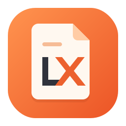
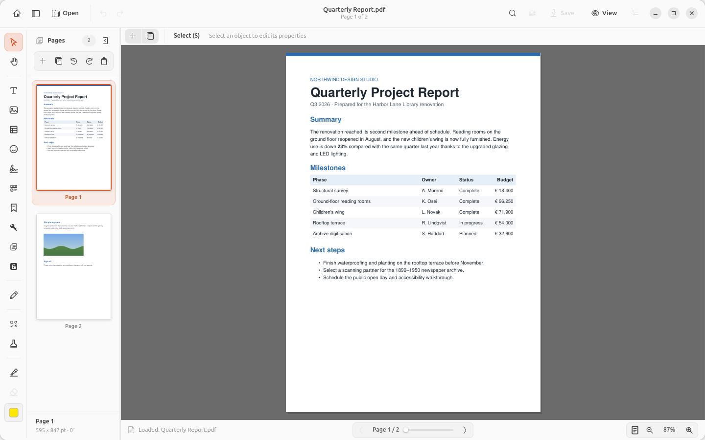
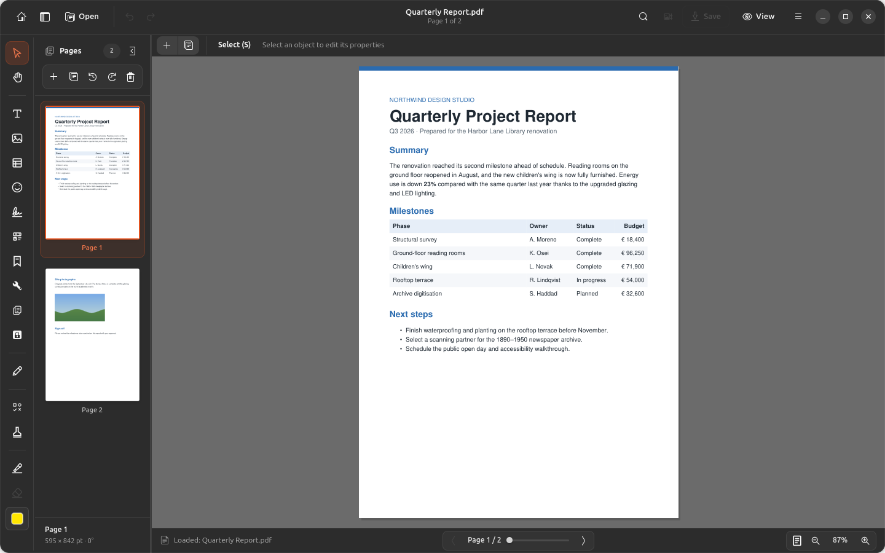
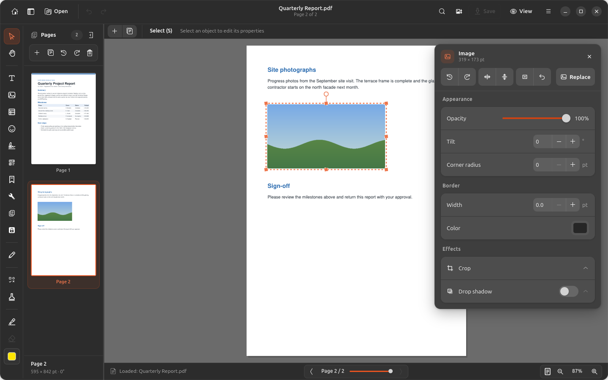
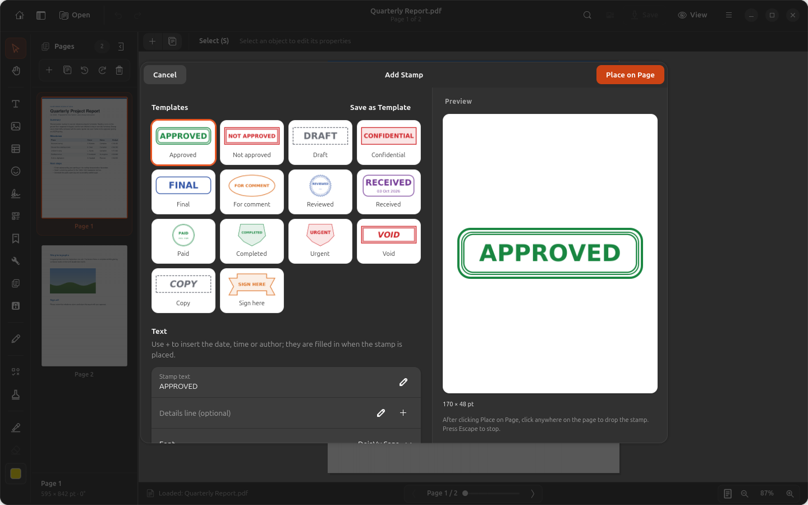
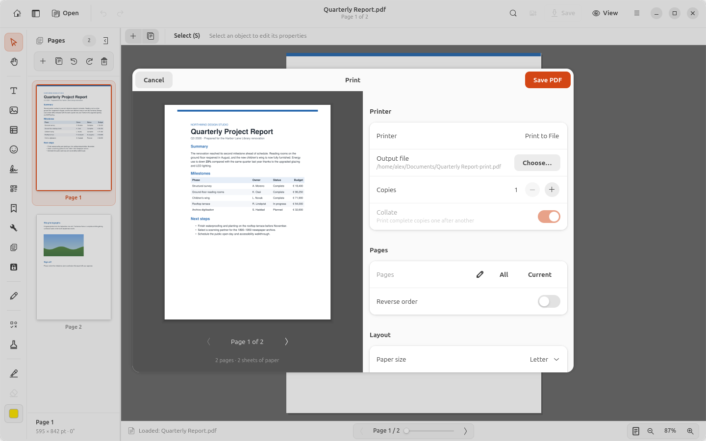
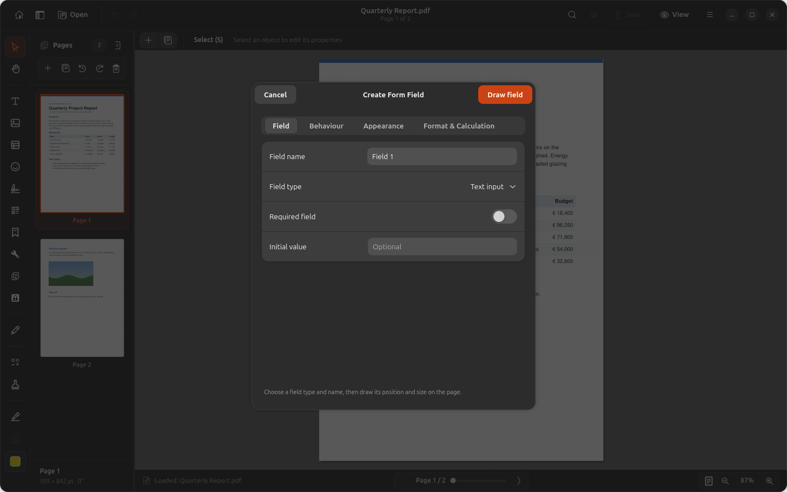
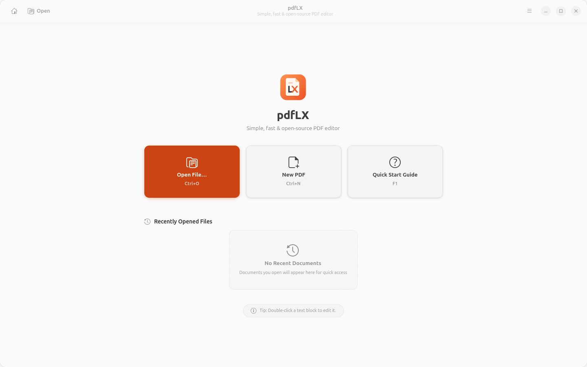

<div align="center">



# pdfLX

**A fast, modern PDF editor for Linux, built with GTK 4 and libadwaita.**

Edit text and images, fill and build forms, review, stamp, sign, organise pages,
and print or export — all locally, with no cloud services.

[](https://github.com/ClaudiuJitea/pdfLX/releases/latest)
[](LICENSE)


[Download](#installation) · [Features](#features) · [Screenshots](#screenshots) · [User guide](docs/USER_GUIDE.md) · [Changelog](CHANGELOG.md)

<br>



</div>

## Why pdfLX?

- **Feels native on GNOME.** Adwaita styling, light and dark themes, and one consistent
  dialog design throughout the app.
- **Real PDF editing.** Change existing text and images, not just draw on top of the page.
- **Private by design.** Everything — including Word export, OCR, and signing — runs on
  your machine.
- **Non-destructive and undoable.** Every edit, from form values to page changes, supports
  undo and redo across pages.

## Features

| Area | What you can do |
|---|---|
| **Edit content** | Edit existing text with fonts, sizes, colours, and alignment; add text boxes; move, resize, tilt, crop, and style images; draw shapes and freehand strokes. |
| **Organise pages** | Insert, extract, split, reorder, rotate, crop, resize, N-up and booklet layouts, headers/footers, Bates numbering, and page labels. |
| **Review** | Sticky notes, highlights, underline/strikeout, callouts and shapes, replies and review states, comment summaries, and redaction with preview. |
| **Stamps** | A stamp designer with 14 templates, custom colours and shapes, date/author fields, and saved templates. |
| **Forms** | Create text fields, checkboxes, dropdowns, lists, radio groups, and buttons; fill on the page; calculations and formatting; import/export form data. |
| **Signatures** | Draw or import a handwritten signature, sign with a `.p12`/`.pfx` certificate, and verify existing signatures. |
| **Protect** | Passwords and permissions, sanitisation, hidden-text scan, and append-only saving that keeps signatures valid. |
| **Print & export** | A print dialog with live sheet preview; export to Word (DOCX), text, Markdown, HTML, images, and SVG. |
| **Read** | Continuous or page-by-page scrolling, two-page and book layouts, presentation mode, night and sepia reading, and search. |
| **Automate** | Batch processing and the `pdflx-cli` command-line tool for merge, optimise, Bates numbering, verification, and more. |

See the [user guide](docs/USER_GUIDE.md) for the full feature reference.

## Screenshots

<table>
<tr>
<td width="50%"><br><sub><b>Dark mode</b> follows your system theme.</sub></td>
<td width="50%"><br><sub><b>Image Tools</b> — opacity, tilt, corners, border, crop, and shadow, applied live.</sub></td>
</tr>
<tr>
<td><br><sub><b>Stamp designer</b> with templates and a live preview.</sub></td>
<td><br><sub><b>Print</b> with a sheet preview, page ranges, scaling, and Print to File.</sub></td>
</tr>
<tr>
<td><br><sub><b>Form fields</b> with behaviour, appearance, and calculation settings.</sub></td>
<td><br><sub><b>Welcome screen</b> with recent documents and a quick-start guide.</sub></td>
</tr>
</table>

## Installation

### Debian / Ubuntu (.deb)

Download `pdflx_<version>_all.deb` from the
[latest release](https://github.com/ClaudiuJitea/pdfLX/releases/latest) and install it:

```sh
sudo apt install ./pdflx_0.3_all.deb
```

This installs the **pdfLX** launcher and the `pdflx-cli` command. Requirements: Ubuntu
24.04+ or Debian 13+ (GTK 4 and libadwaita 1.5 or newer). APT installs the system
dependencies; the installer downloads the Python libraries (PyMuPDF, pdf2docx, pyHanko)
into `/opt/pdflx/.venv`, so internet access is needed during installation.

### From source

You need Python 3.10+, GTK 4, libadwaita 1.5+, and PyGObject. On Ubuntu/Debian:

```sh
sudo apt install python3-gi python3-gi-cairo gir1.2-gtk-4.0 gir1.2-adw-1 python3-venv
git clone https://github.com/ClaudiuJitea/pdfLX.git
cd pdfLX
python3 -m venv --system-site-packages .venv
.venv/bin/pip install -e .
.venv/bin/pdflx
```

Or with conda:

```sh
conda env create -f environment.yml
conda activate pdfLX
python run-editor.py
```

### Optional extras

- **OCR** (Tools ▸ Recognize Text): `sudo apt install tesseract-ocr tesseract-ocr-eng`
  (plus any other language packs you need).

## Command line

```sh
pdflx-cli merge a.pdf b.pdf -o merged.pdf
pdflx-cli optimize scans/*.pdf -d smaller/
pdflx-cli bates contract.pdf --prefix ACME- -o numbered.pdf
pdflx-cli verify signed.pdf
pdflx-cli --help
```

## Handy shortcuts

| Shortcut | Action |
|---|---|
| `Ctrl+O` / `Ctrl+N` | Open / new PDF |
| `Ctrl+S` | Save |
| `Ctrl+Z` / `Ctrl+Shift+Z` | Undo / redo |
| `Ctrl+P` | Print |
| `S` / `M` | Select tool / pan tool |
| `H` | Highlight the selection |
| `Ctrl+D` | Duplicate the selected form field |
| `F5` | Presentation mode |
| `F11` or double-click | Document-only fullscreen |
| `F1` | Quick start guide |

## Building packages

```sh
./build-deb.sh            # dist/pdflx_<version>_all.deb
./build-deb.sh --offline  # bundles Python wheels for offline installs on matching systems
./build-appimage.sh       # AppImage and portable packages
```

`org.pdflx.Editor.json` is the Flatpak manifest, and `debian/` contains the Debian
packaging.

## Development

```sh
python -m unittest discover -s tests -p 'test_*.py'
```

The tests need GTK and the app's dependencies; the GTK interaction tests also need a
display. The code is organised as:

```
pdflx/
├── window.py            Main window, canvas, and tools
├── dialogs.py           Shared dialog toolkit (SheetDialog, OperationDialog, rows)
├── print_dialog.py      Print dialog and sheet preview
├── stamp_dialog.py      Stamp designer
├── image_editor_dialog.py  Image Tools inspector
├── features/            Menu features (pages, review, protect, convert, …)
├── ops/                 Document operations independent of the UI
└── style.css            Application stylesheet
```

Contributions are welcome — see [CONTRIBUTING.md](CONTRIBUTING.md) and the
[code of conduct](CODE_OF_CONDUCT.md).

## Credits

pdfLX builds on the open-source
[word-sys PDF editor](https://github.com/word-sys/word-sys-pdf-editor) by Barın Güzeldemirci,
word-sys, and contributors. PDF rendering and editing use [PyMuPDF](https://pymupdf.readthedocs.io/),
Word export uses [pdf2docx](https://github.com/ArtifexSoftware/pdf2docx), and certificate
signing uses [pyHanko](https://github.com/MatthiasValvekens/pyHanko).

## License

pdfLX is free software, released under the
[GNU General Public License v3.0 or later](LICENSE).
